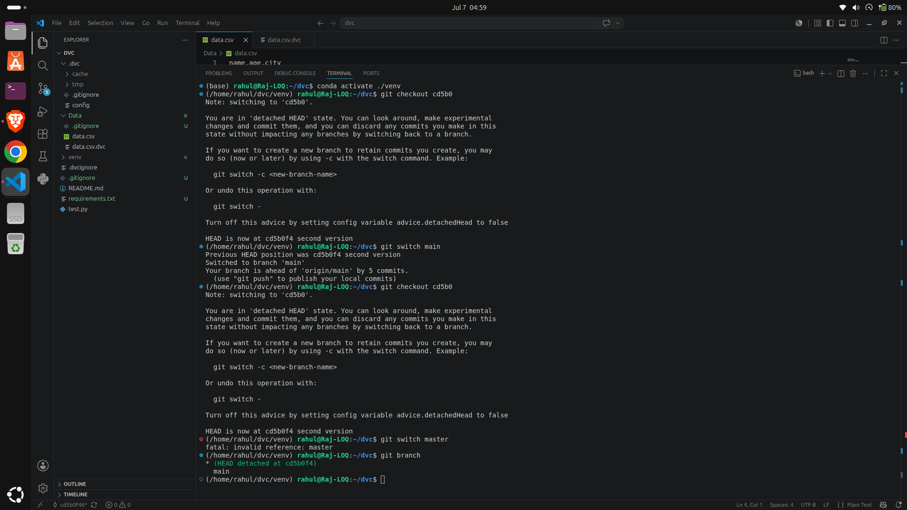
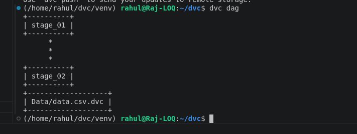

# 📦 Data Version Control (DVC) Demo

## Overview
This project demonstrates how to use **Git** together with **Data Version Control (DVC)** to version datasets independently from source code. It shows how to track multiple versions of a CSV file, restore previous versions, and manage data efficiently.

## Technologies
- Git
- DVC
- Python
- Conda
- Pandas

## Workflow

1. Initialize Git
```bash
git init
```

2. Initialize DVC
```bash
dvc init
```

3. Create Dataset
```bash
python test.py
```

4. Track Dataset
```bash
dvc add data.csv
```

5. Commit Changes
```bash
git add .
git commit -m "First version"
```

6. Modify Dataset and Repeat
```bash
dvc add data.csv
git add .
git commit -m "Second version"
```

7. Restore Previous Version
```bash
git checkout <commit-id>
dvc checkout
```

## Project Structure

```text
.
├── data.csv
├── data.csv.dvc
├── test.py
├── requirements.txt
├── .dvc/
├── .dvcignore
└── README.md
```

## Demo




## Result

- Successfully tracked datasets using DVC.
- Managed dataset versions without storing large files in Git.
- Restored previous dataset versions using Git and DVC.

## Author

**Rahul Raj**